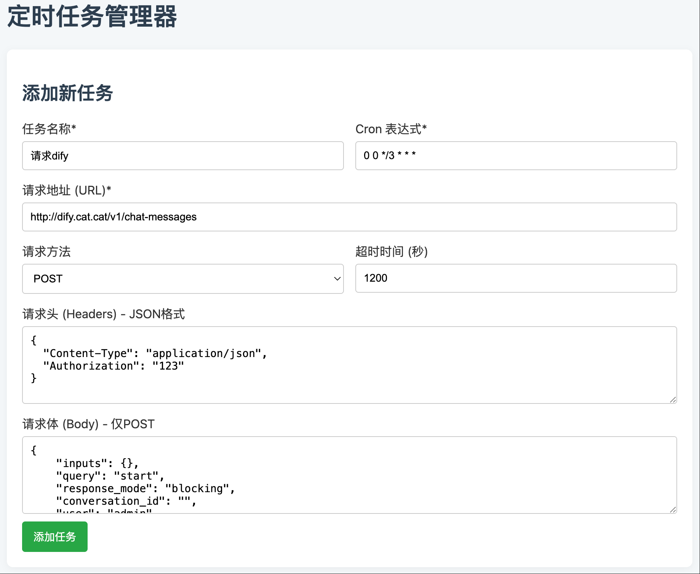
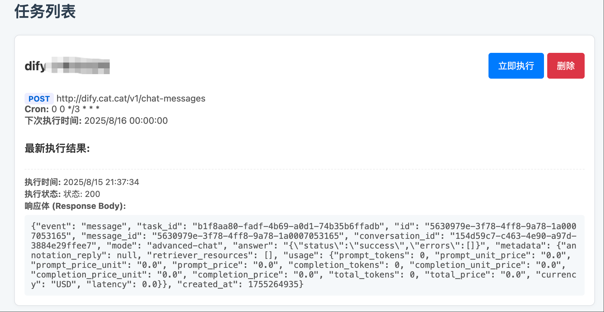

<div align="center">
  
</div>

###

<h1 align="center">pipiGo</h1>

<div align="center">
   English | <a href="./README-zh.md">中文文档</a>
</div>

###

A minimalistic task scheduler for periodic API requests.

Born from a personal need: I wanted to trigger a Dify workflow API every 3 hours and run certain tasks, with a simple
web UI to manage everything.

I looked into many open-source frameworks, but they were either too heavy or overloaded with features I didn’t
need.     
All I wanted was a lightweight tool to create, read, update, delete, and schedule HTTP requests — nothing more.     
Then came the moment of inspiration (thanks, large language model 🤖), and pipiGo was born.

### Deployment

```bash
docker compose build

docker compose up -d
```

Task data is automatically saved to an SQLite file.

### UI




